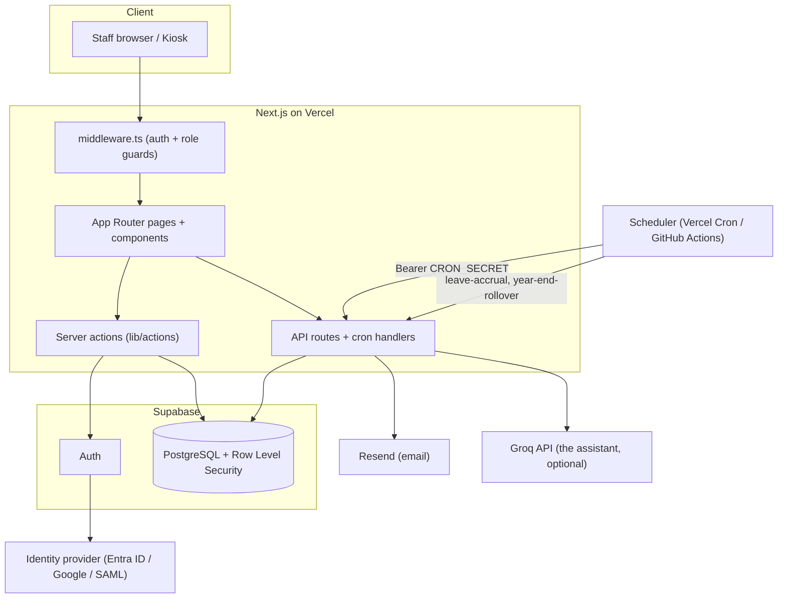

# Uptilldawn Crew Management

Current implementation and verified limitations: [UPTILLDAWN_IMPLEMENTATION_STATUS.md](UPTILLDAWN_IMPLEMENTATION_STATUS.md).

Deployment instructions: [DEPLOYMENT.md](DEPLOYMENT.md). The material below is retained historical StaffPortal documentation and is not the active Uptilldawn setup guide.

---

# StaffPortal

> Self-hosted, open-source HR and workforce platform built with Next.js, Supabase, and Tailwind CSS.

[](https://github.com/sarmakska/staff-portal/actions/workflows/ci.yml)
[](LICENSE)
[](https://github.com/sarmakska/staff-portal)
[](https://github.com/sarmakska/staff-portal/commits/main)
[](https://nextjs.org)
[](https://typescriptlang.org)
[](https://supabase.com)

StaffPortal is a full-featured HR and workforce management platform you run on your own infrastructure. It covers attendance, leave, timesheets, expenses, visitors, wellness, and IT support behind a single role-based login, with single sign-on, an immutable audit trail, GDPR data exports, monthly leave accruals, a mobile-friendly kiosk, and an optional conversational AI assistant. It is built for small-to-medium organisations that want a modern, clean alternative to expensive HR software without handing staff data to a third party.

Full documentation lives in the [project wiki](https://github.com/sarmakska/staff-portal/wiki): start with [Home](https://github.com/sarmakska/staff-portal/wiki), then [Quick-Start](https://github.com/sarmakska/staff-portal/wiki/Quick-Start), [Architecture](https://github.com/sarmakska/staff-portal/wiki/Architecture), [Single-Sign-On](https://github.com/sarmakska/staff-portal/wiki/Single-Sign-On), [Leave-Accruals](https://github.com/sarmakska/staff-portal/wiki/Leave-Accruals), [GDPR-Export](https://github.com/sarmakska/staff-portal/wiki/GDPR-Export), [Kiosk-Mode](https://github.com/sarmakska/staff-portal/wiki/Kiosk-Mode), [Audit-Log](https://github.com/sarmakska/staff-portal/wiki/Audit-Log), and [Roadmap](https://github.com/sarmakska/staff-portal/wiki/Roadmap).

---

## Quickstart

Five commands from a fresh clone to a running dev server. You will need a free [Supabase](https://supabase.com) project and a [Resend](https://resend.com) API key first.

```bash
git clone https://github.com/sarmakska/staff-portal.git && cd staff-portal
npm install
cp .env.local.example .env.local   # then fill in your Supabase and Resend keys
npm run lint && npm test            # confirm the toolchain is healthy
npm run dev                         # open http://localhost:3000
```

Run the SQL files in `supabase/migrations/` in numbered order against your Supabase project before first login. The full step-by-step setup, including auth redirect URLs and creating the first admin, is in [Getting Started](#getting-started) below.

---

## When to use this, and when not to

Use StaffPortal if you are a small-to-medium organisation that wants to own its staff data, self-host on Vercel and Supabase, and run attendance, leave, expenses, and visitor management from one place. It suits teams that are comfortable managing a Supabase project and a few environment variables, and that want a codebase they can fork and extend rather than a closed SaaS subscription.

Look elsewhere if you need certified payroll processing, statutory tax filing, or deep integration with an existing enterprise HRIS out of the box. It is not a multi-tenant SaaS product: each deployment serves one organisation. If you cannot run a Supabase instance or do not want to manage your own deployment, a hosted HR product will be a better fit.

---

## Architecture



---

## What is in the box

### For All Staff

- **Dashboard** — Personalised overview: leave balances, week hours summary, diary reminders, quick actions
- **Attendance** — Clock in/out, work from home toggle, running late logging, late arrival detection
- **WFH Logging** — Log full day, morning, or afternoon as work from home
- **Attendance Corrections** — Submit correction requests with approval workflow
- **Timesheets** — Weekly hours view with contracted hours tracking and Excel export
- **Leave** — Apply for annual, sick, maternity/paternity, or unpaid leave; multi-step approval with PDF certificates
- **Leave Withdrawal** — Withdraw approved leave; full record kept, balance reversed, email sent
- **Expenses** — Expense claims with category, merchant, amount, receipt upload; PDF claim forms
- **Purchase Requests** — Submit purchase requests for admin approval
- **Diary** — Personal work notes with date-based email reminders
- **Calendar** — Team-wide calendar showing leave, WFH, events, and office presence
- **Staff Directory** — Contact cards with phone, email, and profile details
- **Announcements** — Company-wide announcements with email broadcast
- **Polls** — Company polls with real-time vote counts
- **AI Assistant (the assistant)** — Conversational AI assistant with awareness of your attendance, leave, expenses, and team

### For Reception and Admin

- **Visitors** — Pre-register visitors, QR code references, host email notifications on check-in
- **Reception Desk** — Quick check-in and check-out for today's visitors
- **Visitor PDF Passes** — Generate and print visitor passes
- **Kiosk Mode** — Self-service clock in/out and visitor check-in at `/kiosk` (no login required)

### Wellness

- Wellness check-ins and mood tracking
- Breathing exercises and stretch reminders
- Admin wellness dashboard

### IT Support

- IT ticket submission
- Admin ticket management and status tracking
- Auto-cleanup of resolved tickets via cron

### Admin

- **User Management** — Create, activate/deactivate accounts, assign roles
- **Department Management** — Create and manage departments
- **Work Schedule Management** — Set per-user contracted hours and working days
- **Leave Records** — Full leave history with filters; resend approval emails
- **Leave Allowances** — Set balances per employee, configure carry-forward caps
- **Leave Accruals** — Monthly accrual top-ups per balance, capped at full entitlement, run by cron or on demand
- **Corrections Management** — Review and approve timesheet correction requests
- **Forgotten Clock-Outs** — Auto-detect staff who forgot to clock out
- **Email Notification Settings** — Toggle each notification type on/off individually
- **Analytics** — Late arrivals, WFH trends, office attendance, hours vs contracted; CSV export
- **Bank Statement Reconciliation** — Export and reconcile expense data
- **Single Sign-On** — Route staff to Microsoft Entra ID, Google Workspace, GitHub, GitLab, or SAML 2.0 by email domain
- **Audit Log** — Full immutable system audit trail, including SSO logins, leave accruals, and GDPR exports
- **GDPR Data Export** — One-click portable JSON export of every record held about a member

---

## AI Assistant (the assistant)

The built-in AI assistant is powered by [Groq](https://console.groq.com) and has real-time access to:

- Your attendance records — clock in/out times, late arrivals
- Your leave balances and upcoming approved leave
- Your contracted hours vs actual hours this week (overtime calculator)
- Team leave — who is off this week and next week
- Who is currently in the office (WFH vs office)
- Upcoming team birthdays
- Your recent expenses and purchase requests
- Active polls and announcements
- Issue reporting — collects details and emails the admin team
- Wellness support mode

The assistant's personality and system prompt are fully customisable in `app/api/chat/route.ts`. You can swap Groq for any OpenAI-compatible API.

---

## Single sign-on

Staff can sign in with your organisation's identity provider. SSO is layered on top of Supabase Auth, so it coexists with email and password and the kiosk PIN flow without any second session system.

An admin maps an email domain to a provider under **Admin → Single Sign-On**. When a member types an email whose domain has an active connection, the login screen routes them straight to the identity provider instead of asking for a password:

- OAuth providers (Microsoft Entra ID, Google Workspace, GitHub, GitLab) use Supabase `signInWithOAuth`.
- SAML 2.0 connections use Supabase `signInWithSSO`.

First-time SSO sign-ins bootstrap a profile and the standard leave balances, and every SSO login is written to the audit log. The provider apps and SAML metadata are configured in the Supabase dashboard under **Authentication → Providers** and **Authentication → SSO**.

## Leave accruals

Each leave balance can carry a monthly `accrual_rate`. A cron job (`/api/cron/leave-accrual`, first of each month) tops every accruing balance up by the elapsed months times its rate, capped at the configured entitlement. The job is idempotent: re-running in the same month grants nothing further, because each balance records how much it has accrued and when. Admins and accounts staff can preview and run accruals on demand under **Admin → Leave Accruals**.

At year end a second cron job (`/api/cron/year-end-rollover`, 1 January) opens each employee's new leave year. Unused, unpending days carry over, capped per employee by `max_carry_forward`, and the prior year's carried amount is stripped from the base so carry-forward never compounds from one year to the next. The carry-forward arithmetic is a pure helper (`computeCarryForward`) shared with the route and covered by its own test suite, so an over-spent balance can never produce a negative carry.

## GDPR data export

Under the right to data portability, any signed-in member can download a single portable JSON document containing every record held about them (profile, attendance, leave, expenses, diary, visitors, feedback, complaints, and the audit events attributed to them) from **Settings → Privacy and data**. Administrators can export another member by calling `/api/gdpr/export?userId=<id>`. Every export is recorded in the audit log.

The set of personal-data tables is declared once in `GDPR_TABLES`, and the export route asserts at module load that it covers every declared table (`assertGdprCoverage`). If a new personal-data table is added but not wired into the export, the build and the test suite fail before an incomplete export can reach a data subject.

## Tech Stack

| Layer | Technology |
|-------|-----------|
| Framework | Next.js 16 (App Router, React 19) |
| Language | TypeScript |
| Database & Auth | Supabase (PostgreSQL + Row Level Security) |
| Styling | Tailwind CSS + shadcn/ui |
| Email | Resend |
| AI | Groq API (llama-3.3-70b-versatile) — optional |
| PDF | PDFKit |
| Charts | Recharts |
| Excel Export | ExcelJS |
| Deployment | Vercel (recommended) |

---

## Roles

| Role | Access Level |
|------|-------------|
| `employee` | Own attendance, timesheets, leave, expenses, diary, calendar, announcements |
| `reception` | Employee + visitors, reception desk, kiosk settings |
| `director` | Employee + analytics, all timesheets (read-only), staff summary |
| `accounts` | Employee + all timesheets (read-only), expense reports |
| `admin` | Full access to everything |

---

## Getting Started

### Prerequisites

- [Node.js 20+](https://nodejs.org)
- [Supabase account](https://supabase.com) — free tier works
- [Resend account](https://resend.com) — free tier works
- [Groq API key](https://console.groq.com) — optional, only needed for the AI assistant

### 1. Clone the repo

```bash
git clone https://github.com/sarmakska/staff-portal.git
cd staff-portal
npm install
```

### 2. Add your logo

Replace the placeholder logo with your own:

- **Sidebar & kiosk logo:** Replace `public/logo.svg` with your logo file (SVG recommended, or rename to `logo.png` and update references)
- **Browser favicon / tab icon:** Replace `app/icon.png`, `public/apple-icon.png`, `public/icon-dark-32x32.png`, `public/icon-light-32x32.png` with your own icons
- **PDF documents:** Place a `public/logo.png` (PNG format, recommended size 300×80px) — the PDFs automatically pick it up. If the file is missing, PDFs generate without a logo.

> The sidebar logo is displayed at `h-7` (28px height) — a wide horizontal logo works best.

### 3. Create a Supabase project

1. Go to [supabase.com](https://supabase.com) and sign in
2. Click **New Project**, set a name and strong database password
3. Wait ~1 minute for the project to be ready
4. Go to **Project Settings → API** and copy:
   - **Project URL**
   - **anon/public** key
   - **service_role** key _(keep this secret — server-side only)_

### 4. Run the database migrations

1. In Supabase, go to **SQL Editor**
2. Open each file in `supabase/migrations/` in numbered order
3. Paste and run them one by one: `001_...`, `002_...`, through all files

Or use the Supabase CLI:

```bash
supabase db push
```

### 5. Configure environment variables

```bash
cp .env.local.example .env.local
```

Fill in `.env.local` with your values. See the [Environment Variables](#environment-variables) section below.

### 6. Configure Supabase Auth

1. In Supabase go to **Authentication → URL Configuration**
2. Set **Site URL** to `http://localhost:3000`
3. Add `http://localhost:3000/auth/callback` to **Redirect URLs**

### 7. Run locally

```bash
npm run dev
```

Open [http://localhost:3000](http://localhost:3000).

### 8. Create your admin account

1. Go to `/signup` and sign up with your admin email address
2. Verify your email via the confirmation link
3. Log in — update your role to `admin` directly in the Supabase table editor

### 9. Deploy to Vercel

```bash
npx vercel
```

Add all environment variables in the Vercel dashboard under **Project Settings → Environment Variables**. Update `NEXT_PUBLIC_APP_URL` to your production URL.

After deploying, update Supabase:
- **Authentication → Site URL** → your production URL
- **Redirect URLs** → add `https://your-domain.com/auth/callback`

---

## Environment Variables

| Variable | Description | Required |
|----------|-------------|----------|
| `NEXT_PUBLIC_SUPABASE_URL` | Supabase project URL | Yes |
| `NEXT_PUBLIC_SUPABASE_ANON_KEY` | Supabase anon key | Yes |
| `SUPABASE_SERVICE_ROLE_KEY` | Supabase service role key (server-side only) | Yes |
| `RESEND_API_KEY` | Resend API key for sending emails | Yes |
| `RESEND_FROM_EMAIL` | Sender email address (e.g. `noreply@yourcompany.com`) | Yes |
| `NEXT_PUBLIC_APP_URL` | Your app's public URL | Yes |
| `CRON_SECRET` | Secret token to authenticate cron job requests | Yes |
| `GROQ_API_KEY` | Groq API key for the AI assistant — comma-separate multiple keys for load balancing | Optional |
| `ACCOUNTS_EMAIL` | Accounts team email for finance notifications | Optional |
| `ADMIN_NOTIFY_EMAIL` | Admin email for system notifications | Optional |

See `.env.local.example` for the full list with descriptions.

---

## Cron Jobs

StaffPortal uses cron jobs for automated reminders and maintenance. GitHub Actions workflow files are included in `.github/workflows/` — add your `APP_URL` and `CRON_SECRET` as repository secrets to activate them.

Alternatively, configure them in `vercel.json` for Vercel Cron, or use any cron service that can call your API endpoints with the `Authorization: Bearer <CRON_SECRET>` header.

| Job | Endpoint | Recommended Schedule |
|-----|----------|---------------------|
| Birthday reminders | `/api/cron/birthday-reminder` | Daily 8am |
| Absent reminders | `/api/cron/absent-reminder` | Daily 10am |
| Missing attendance | `/api/cron/missing-attendance` | Daily 6pm |
| Forgotten clock-out | `/api/cron/forgotten-clockout` | Daily 8pm |
| Leave accrual | `/api/cron/leave-accrual` | Monthly, 1st at 00:10 UTC |
| Year-end rollover | `/api/cron/year-end-rollover` | Yearly, 1 Jan at 00:05 UTC |
| Stretch reminder | `/api/cron/stretch-reminder` | Weekdays 2pm |
| IT ticket cleanup | `/api/cron/it-ticket-cleanup` | Weekly |

---

## Project Structure

```
staff-portal/
├── app/
│   ├── (app)/              # All authenticated app pages
│   │   ├── admin/          # Admin-only pages
│   │   ├── analytics/      # Attendance analytics
│   │   ├── expenses/       # Expense management
│   │   ├── help/           # Help & support
│   │   ├── leave/          # Leave management
│   │   ├── visitors/       # Visitor management
│   │   └── wellness/       # Wellness tracking
│   ├── (auth)/             # Auth pages (login, signup, reset)
│   ├── api/                # API routes and cron handlers
│   └── kiosk/              # Public kiosk (no auth required)
├── components/
│   ├── chat/               # AI assistant chat components
│   ├── layout/             # Sidebar, topbar
│   └── ui/                 # Shared shadcn/ui components
├── lib/
│   ├── actions/            # Server actions (all DB operations)
│   ├── email.ts            # Email sending via Resend
│   └── supabase/           # Supabase client utilities
├── supabase/
│   └── migrations/         # Database SQL migrations (run in order)
└── types/                  # TypeScript type definitions
```

---

## Contributing

Pull requests are welcome. For major changes, please open an issue first to discuss what you would like to change.

1. Fork the repository
2. Create a branch: `git checkout -b feature/your-feature`
3. Make your changes and test locally with `npm run dev`
4. Commit: `git commit -m "feat: your feature description"`
5. Push and open a Pull Request

Ideas for contributions:
- Mobile app (React Native / Expo)
- Slack / Teams integration
- Payroll export (Xero, QuickBooks)
- Shift scheduling and rota management
- Custom leave types per organisation
- Multi-language (i18n) support
- Browser-driven UI tests on top of the existing logic test suite

---

## License

[MIT License](LICENSE) — free to use, modify, and distribute for any purpose including commercial use.

---

## Support

Bug reports and feature requests: [GitHub Issues](https://github.com/sarmakska/staff-portal/issues)

---

## About the author

Built by **[Sarma](https://sarmalinux.com/about)** — a UK-based software engineer building open-source AI infrastructure and platform engineering tools. StaffPortal is part of a broader portfolio of twelve production-shaped open-source repositories.

- **Project page** &middot; [sarmalinux.com/products/staff-portal](https://sarmalinux.com/products/staff-portal)
- **Whitepaper** &middot; [sarmalinux.com/products/staff-portal/whitepaper](https://sarmalinux.com/products/staff-portal/whitepaper)
- **All open-source projects** &middot; [sarmalinux.com/open-source](https://sarmalinux.com/open-source)
- **Engineering blog** &middot; [sarmalinux.com/blog](https://sarmalinux.com/blog)


---

## More open source by Sarma

Part of a portfolio of twelve production-shaped open-source repositories built and maintained by [Sarma](https://sarmalinux.com).

| Repository | What it is |
|---|---|
| [Sarmalink-ai](https://github.com/sarmakska/Sarmalink-ai) | Multi-provider OpenAI-compatible AI gateway with 14-engine failover and intent-based plugin auto-routing |
| [agent-orchestrator](https://github.com/sarmakska/agent-orchestrator) | Durable multi-agent workflows in TypeScript with deterministic replay and Inspector UI |
| [voice-agent-starter](https://github.com/sarmakska/voice-agent-starter) | Sub-second full-duplex voice agent loop. WebRTC, mediasoup, pluggable STT / LLM / TTS |
| [ai-eval-runner](https://github.com/sarmakska/ai-eval-runner) | Evals as code. Python, DuckDB, FastAPI viewer, regression mode for CI |
| [mcp-server-toolkit](https://github.com/sarmakska/mcp-server-toolkit) | Production Model Context Protocol server starter (Python / FastAPI) |
| [local-llm-router](https://github.com/sarmakska/local-llm-router) | OpenAI-compatible proxy that routes to Ollama or cloud providers based on policy |
| [rag-over-pdf](https://github.com/sarmakska/rag-over-pdf) | Minimal end-to-end RAG starter for PDF corpora |
| [receipt-scanner](https://github.com/sarmakska/receipt-scanner) | Vision OCR for receipts with Zod-validated JSON output |
| [webhook-to-email](https://github.com/sarmakska/webhook-to-email) | Webhook receiver that forwards events to email via Resend |
| [k8s-ops-toolkit](https://github.com/sarmakska/k8s-ops-toolkit) | Helm chart for shipping Next.js to Kubernetes with full observability stack |
| [terraform-stack](https://github.com/sarmakska/terraform-stack) | Vercel + Supabase + Cloudflare + DigitalOcean modules in one Terraform repo |
| [staff-portal](https://github.com/sarmakska/staff-portal) | Open-source HR / ops portal — leave, attendance, expenses, kiosk mode |

Engineering essays at [sarmalinux.com/blog](https://sarmalinux.com/blog) &middot; All projects at [sarmalinux.com/open-source](https://sarmalinux.com/open-source)
